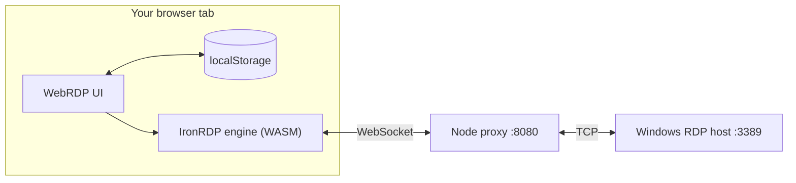
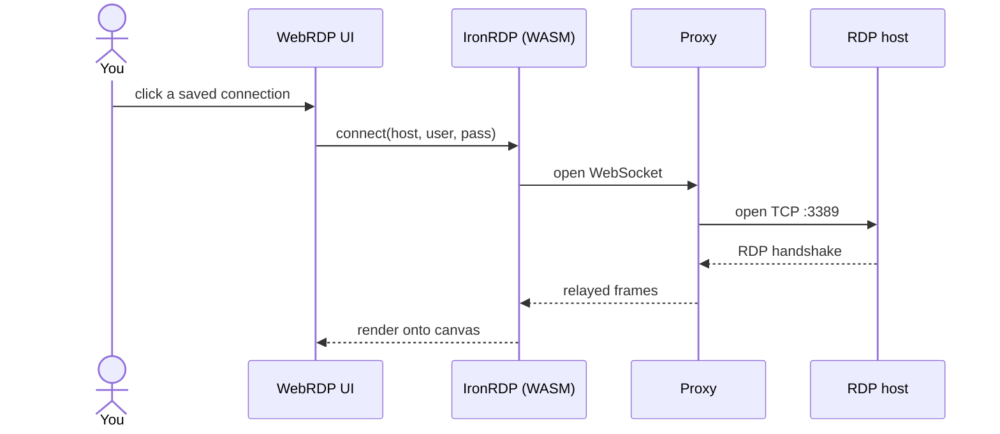

<p align="center">
  
</p>

<h1 align="center">WebRDP</h1>
<p align="center">Browser-only Windows RDP access. No RDP client, no plugins.</p>

---

Save a server's IP, username, and password once, then connect from a
dashboard of your saved machines — or connect once without saving.

## Features

- No login page — you land straight on the dashboard
- No file transfer panel — screen, keyboard/mouse, and clipboard only
- No separate storage server — saved connections live in your browser's
  own `localStorage`, nothing server-side
- Auto-reconnect on a dropped connection, with a heads-up if the screen
  freezes
- One-click screenshots
- Optional auto-connect for the machine you use most

## How it works

[IronRDP](https://github.com/Devolutions/IronRDP) is a Rust
implementation of RDP compiled to WebAssembly, running client-side in
the browser tab. Browsers can only speak WebSocket, not raw TCP, so a
small Node server bridges WebSocket ↔ TCP:3389 and also serves the page.





## Quick start

Requires `git` and Node.js 18+. The WASM engine is pre-built, so no Rust toolchain is required.

```bash
git clone https://github.com/humairaambreen/WebRDP.git
cd WebRDP

npm install          # or ./scripts/setup.sh
npm start            # or ./scripts/start.sh
```

Open `http://localhost:8080`, click "add a new connection," fill in the
server address, username, and password, and hit Connect. Tick "save"
if you want it on the dashboard next time.

Different port: `PORT=8081 ./scripts/start.sh`

## Deploying

A `Dockerfile` is included for container deployment (such as Back4app Containers, Railway, Fly.io, or standard Docker environments). It exposes port `8080`.

## A few things worth knowing

- **No auth gate.** Anyone who can reach the URL sees the dashboard.
  Fine on `localhost` or your own LAN; put it behind a VPN/tunnel/
  firewall if it's ever public.
- **Saved connections are per-browser.** They live in `localStorage`
  for whatever origin you're on — clearing site data clears them, and
  they don't sync across browsers or devices.
- **Auto-reconnect doesn't give up.** A dropped connection keeps
  retrying instead of quitting on its own; only clicking Disconnect
  actually ends a session. If the screen just stops updating without
  disconnecting, you'll get a banner with a manual reconnect button,
  and it'll reconnect on its own after about a minute if you ignore it.
  Turn this off with the bell icon in the dock if you'd rather it stay
  quiet.
- **Connecting by raw IP works** — `scripts/tls-ip-sni-fix.js` patches
  around a Node quirk that otherwise rejects IP addresses in TLS SNI,
  and trusts self-signed certs (which Windows RDP hosts almost always
  present).

## Project structure

```
webrdp/
├── Dockerfile              # for container deployment
├── server.js               # static server + WebSocket proxy
├── package.json
├── pkg/                    # pre-built IronRDP WASM engine
├── lib/
│   └── rdp-proxy.js        # RDCleanPath proxy handler
├── scripts/
│   ├── setup.sh            # one-time: install dependencies
│   ├── start.sh            # run it
│   └── tls-ip-sni-fix.js
└── web/                    # the actual UI
    ├── index.html
    ├── style.css
    ├── app.js
    ├── assets/               # logo, favicons
    └── lib/
        ├── session.js         # connect, reconnect, screenshots
        ├── input.js            # keyboard/mouse
        ├── clipboard.js
        ├── api.js               # saved connections (localStorage)
        ├── dashboard.js
        ├── modal.js
        ├── logger.js
        └── reveal.js             # small blur-in animation helper
```

## License

MIT for this repo's own code. The RDP engine itself is
[IronRDP](https://github.com/Devolutions/IronRDP) by Devolutions.
