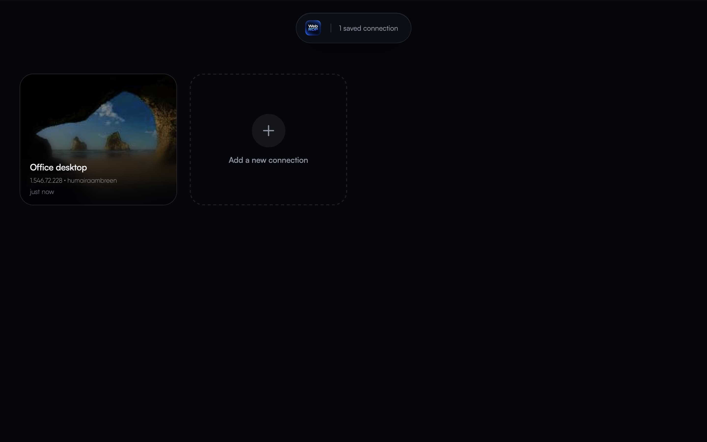
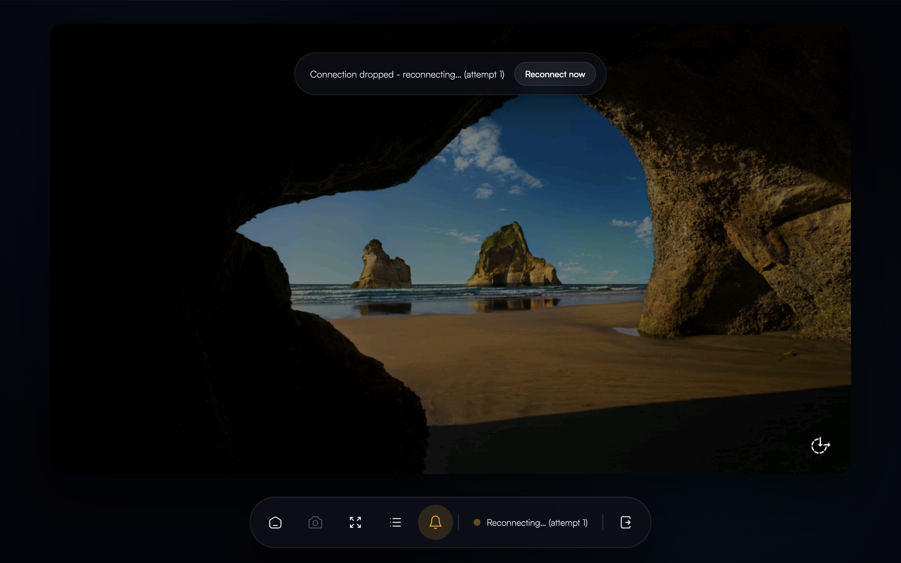
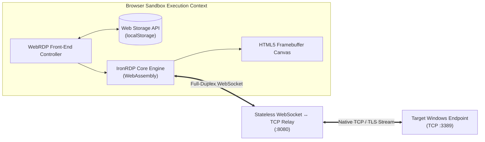
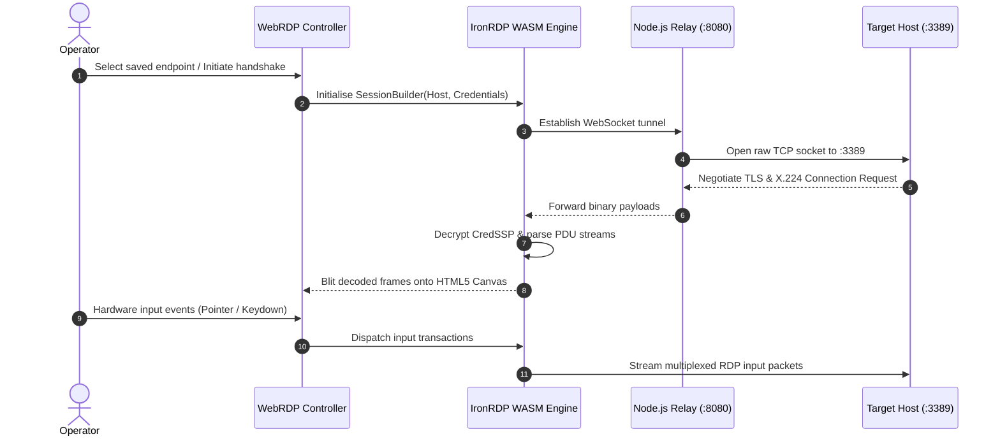

<p align="center">
  
</p>

<h1 align="center">WebRDP</h1>

<p align="center">
  <strong>High-performance, clientless Windows Remote Desktop Protocol (RDP) web gateway utilising WebAssembly and asynchronous transport multiplexing.</strong>
</p>

<p align="center">
  <a href="#abstract">Abstract</a> •
  <a href="#interface-demonstration">Interface</a> •
  <a href="#architectural-overview">Architecture</a> •
  <a href="#key-specifications--engineering-capabilities">Specifications</a> •
  <a href="#installation--local-execution">Installation</a> •
  <a href="#production-deployment--containerisation">Deployment</a> •
  <a href="#licence">Licence</a>
</p>

---

## Abstract

**WebRDP** is a zero-footprint, browser-native remote desktop orchestrator engineered to establish full-duplex, low-latency graphical sessions with Windows endpoints without external client binaries, native browser plugins, or intermediary desktop virtualization infrastructure. 

Underpinned by a client-side WebAssembly execution environment synthesised from [IronRDP](https://github.com/Devolutions/IronRDP), the architecture encapsulates protocol negotiation, bitmap decompression, glyph rendering, and cryptographic handshakes entirely within the browser's sandboxed virtual machine. A stateless, low-overhead Node.js transport relay bridges the disparity between browser WebSocket constraints and native TCP/TLS transport mechanisms on standard RDP port `3389`.

---

## Interface Demonstration

<p align="center">
  
</p>
<p align="center">
  <em>Figure 1: The WebRDP Console — Client-side connection orchestration with encapsulated ephemeral state persistence.</em>
</p>

<br>

<p align="center">
  
</p>
<p align="center">
  <em>Figure 2: Active Graphical Viewport — Real-time hardware-accelerated canvas rendering with persistent session telemetry and autonomous reconnection heuristics.</em>
</p>

---

## Architectural Overview

Web browsers prohibit direct arbitrary TCP socket instantiation from scripts. WebRDP resolves this boundary limitation by employing a decoupled duplex relay topology:

1. **Presentation & Cryptographic Layer (Browser DOM / WASM Engine):** The browser initialises the `wasm32-unknown-unknown` compiled IronRDP engine, executing ASN.1 parsing, CredSSP/TLS encryption negotiation, and RDCleanPath transport abstraction client-side.
2. **Transport Decoupling Layer (Node.js Proxy):** A dual HTTP/WebSocket daemon serves the static application bundle and WASM modules while providing a transparent, non-terminating binary bridge between WebSocket frames and raw TCP streams.
3. **Endpoint Layer (Windows Host):** The target workstation or server processes the inbound session as an authentic, direct RDP connection over TCP:3389.

### Topology Diagram



### Session Lifecycle Sequence



---

## Key Specifications & Engineering Capabilities

* **Zero Native Footprint:** Eliminates ActiveX, Java applets, client executables, and administrative privilege requirements on the operator device.
* **Client-Isolated Credential Storage:** Endpoints and connection profiles persist strictly within client-origin `localStorage`, safeguarding sensitive credentials against server-side data breaches and eliminating backend database dependencies.
* **Autonomous Reconnection State Machine:** Employs an automated heuristic supervisor that detects framebuffer starvation, network transient partitions, or socket termination, triggering exponential backoff reconnections while retaining session state.
* **Asynchronous Clipboard Synchronisation:** Integrates with the browser's native Clipboard API for seamless bidirectional character transfer between host and client sessions.
* **TLS SNI Sanitisation & Self-Signed Cert Tolerance:** Employs an internal transport shim (`tls-ip-sni-fix.js`) that suppresses RFC 6066 Server Name Indication violations when targeting raw IPv4/IPv6 addresses and accommodates self-signed enterprise certificates.
* **Sub-Second Framebuffer Capture:** Integrated telemetry and diagnostics dock offering single-action PNG canvas serialization.

---

## Technical Taxonomy & Repository Structure

```
webrdp/
├── Dockerfile                  # OCI multi-platform container specification
├── server.js                   # High-concurrency static daemon & WebSocket proxy
├── package.json                # Runtime dependencies (Express, Express-WS)
├── pkg/                        # Pre-compiled IronRDP WebAssembly bytecode
│   ├── rdp_client_bg.wasm      # Serialised WASM binary module
│   └── rdp_client.js           # ES Module JavaScript bindings
├── lib/
│   └── rdp-proxy.js            # ASN.1 DER RDCleanPath transport implementation
├── screenshots/                # Visual telemetry and documentation assets
│   ├── mainscreenshot.jpg      # Management console preview
│   └── connectedscreenshot.png # Framebuffer stage preview
├── scripts/
│   ├── setup.sh                # Deterministic dependency bootstrap utility
│   ├── start.sh                # Local daemon lifecycle supervisor
│   └── tls-ip-sni-fix.js       # Dynamic TLS socket patch for raw IP negotiation
└── web/                        # Presentation interface
    ├── index.html              # Single-page application entrypoint
    ├── style.css               # Hardware-accelerated design stylesheet
    ├── app.js                  # DOM lifecycle and module orchestrator
    ├── assets/                 # Vector brandmarks, favicons, and manifests
    └── lib/                    # Modular presentation subroutines
        ├── api.js              # Encapsulated Web Storage persistence layer
        ├── clipboard.js        # Asynchronous clipboard bridge
        ├── dashboard.js        # Dynamic connection card manager
        ├── input.js            # Keyboard scancode & pointer normaliser
        ├── logger.js           # Diagnostics buffer and telemetry drawer
        ├── modal.js            # Modal dialogue controller
        ├── reveal.js           # Dynamic visual reveal orchestration
        └── session.js          # RDP session supervisor & canvas stage
```

---

## Installation & Local Execution

### Prerequisites
* Operating System: Linux, macOS, or Windows (via WSL2)
* Runtime: Node.js 18.0.0 LTS or later
* Git Version Control

```bash
# Clone the repository
git clone https://github.com/humairaambreen/WebRDP.git
cd WebRDP

# Install runtime dependencies
npm install

# Launch the daemon
npm start
```

Navigate to `http://localhost:8080` in any evergreen browser. Configure target host coordinates, credentials, and select **Connect**.

> **Port Configuration:** Override the default listener via standard environment assignment:
> ```bash
> PORT=9000 npm start
> ```

---

## Production Deployment & Containerisation

The project encapsulates a lightweight Open Container Initiative (OCI) specification running unprivileged under the official Node runtime:

```bash
# Build production container image
docker build -t webrdp:latest .

# Instantiate containerized daemon on port 8080
docker run -d \
  --name webrdp \
  --restart unless-stopped \
  -p 8080:8080 \
  webrdp:latest
```

### Security Considerations for Public Networks

Because authentication occurs directly at the target Windows endpoint rather than at an intermediate access management proxy:
* **Stateless Relay Access:** Ensure deployments intended for untrusted networks are encapsulated within a corporate Virtual Private Network (VPN), WireGuard mesh, or behind an Identity-Aware Reverse Proxy (such as Cloudflare Access or OAuth2-Proxy).
* **Certificate Policies:** While self-signed TLS certificates presented by default Windows RDP servers are accommodated, production nodes should employ verifiable certificates issued by an authoritative Certificate Authority (CA) where feasible.

---

## Licence

Distributed under the **MIT Licence**. Core RDP cryptographic parsing and rendering capabilities provided via [IronRDP](https://github.com/Devolutions/IronRDP) by Devolutions under Apache-2.0 / MIT.
